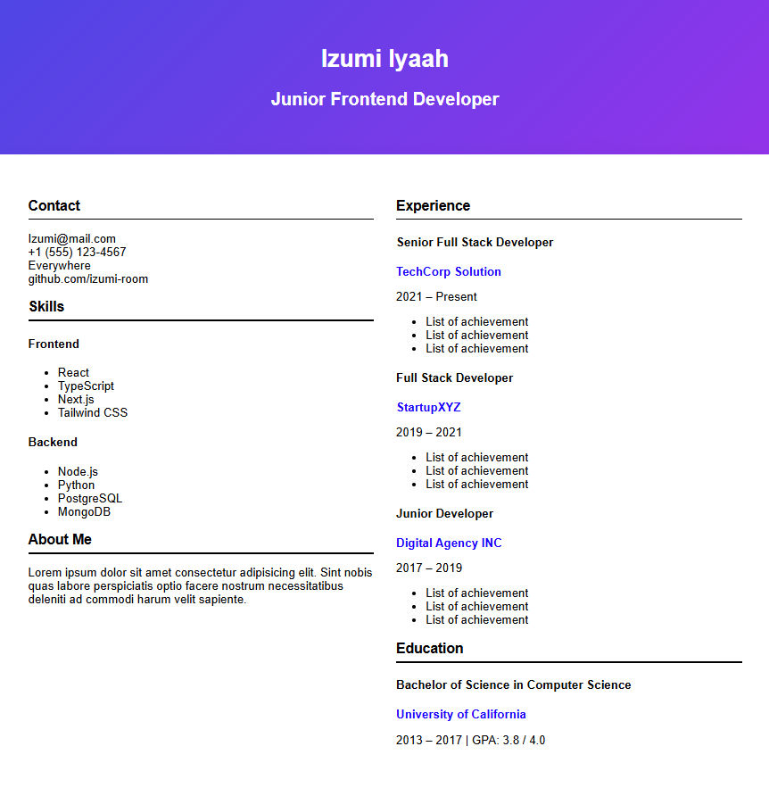

# Roadmap.sh Project Solution
Project ideas to take you from beginner to advanced in Frontend
# [Frontend Project](https://roadmap.sh/frontend)

<table>
    <tbody>
        <tr>
            <td>
                
                <h2><a href='https://roadmap.sh/projects/single-page-cv'>Single Page CV</a></h2>
            </td>
